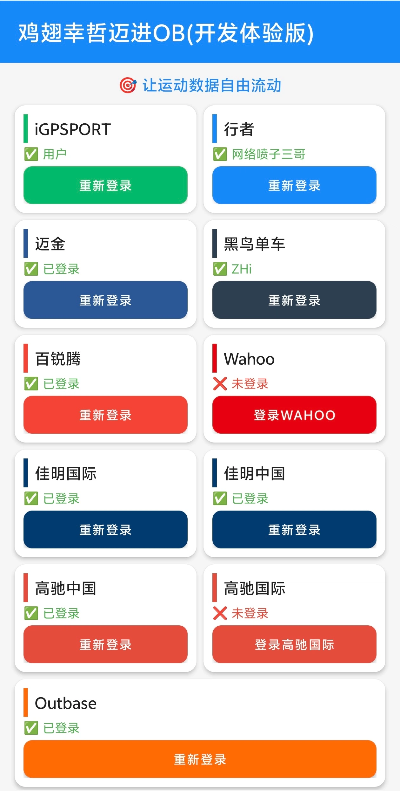
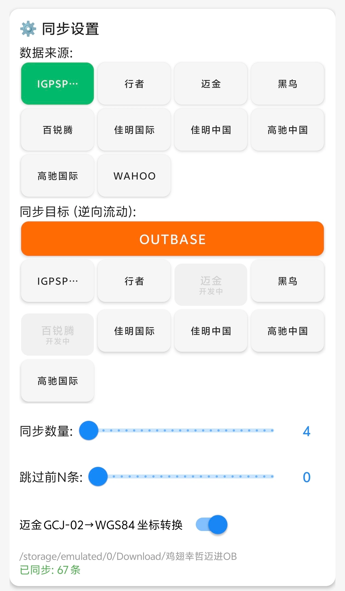
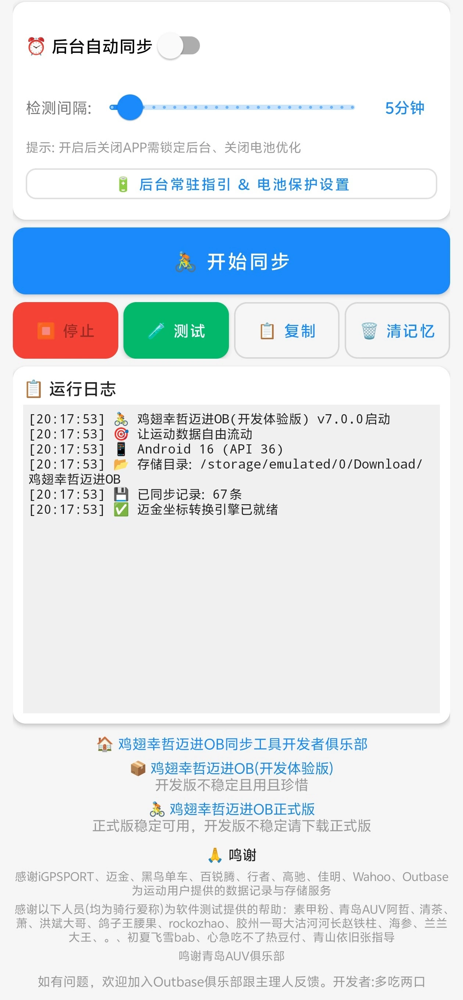

# 🚴 鸡翅幸哲迈进OB(开发体验版)

<p align="center"></p>

**让运动数据自由流动 — 十一平台运动数据互传工具**

[](https://developer.android.com)
[](https://kotlinlang.org)
[](LICENSE)
[]()
[]()

一款 Android 运动数据迁移工具，支持在 **iGPSPORT / 行者 / 迈金 / 黑鸟单车 / 百锐腾 / Outbase / 佳明国际 / 佳明中国 / 高驰中国 / 高驰国际 / Wahoo** 十一平台之间自由同步运动记录（FIT/GPX），支持国内区与国际区互传。

> ⚠️ **开发版不稳定且用且珍惜**，仅供测试体验。

---

## 📱 应用信息

| 项目 | 内容 |
|------|------|
| 应用名称 | 鸡翅幸哲迈进OB(开发体验版) |
| 包名 | `com.jichi.ob.dev` |
| 当前版本 | v7.1.4 |
| 最低系统 | Android 8.0 (API 26) |
| 目标系统 | Android 16 (API 36) |
| 开发语言 | Kotlin |

---

## 📱 软件界面

| 登录页 | 同步设置 | 运行日志 |
|:---:|:---:|:---:|
|  |  |  |

- **登录页**：十一平台登录卡片，两列布局，已登录状态一目了然
- **同步设置**：数据来源/同步目标四列网格，Outbase独占一行，开发中按钮两行显示
- **运行日志**：后台自动同步、开始同步、测试下载、运行日志实时输出

---

## ✨ 功能特性

### 十一平台数据互传

| 平台 | 下载(源) | 上传(目标) | 说明 |
|------|:---:|:---:|------|
| **iGPSPORT** | ✅ | ✅ | 迹驰码表数据，OSS直传上传 |
| **行者** | ✅ | ✅ | 行者APP数据，官方开放API |
| **迈金** | ✅ | 🚧 开发中 | 支持GCJ-02→WGS84坐标转换 |
| **黑鸟单车** | ✅ | ✅ | 仅接受FIT，GPX自动转换 |
| **百锐腾** | ⚠️ | 🚧 开发中 | 官方未开放FIT下载接口 |
| **Outbase** | ❌ | ✅ | 仅目标平台，聚合上传 |
| **佳明国际** | ✅ | ✅ | Garmin Connect国际区，mobile SSO认证 |
| **佳明中国** | ✅ | ✅ | Garmin Connect中国区，WebView通道绕过Cloudflare |
| **高驰中国** | ✅ | ✅ | COROS中国区，OSS+fit/import上传 |
| **高驰国际** | ✅ | ✅ | COROS国际/欧洲区，AWS S3上传 |
| **Wahoo** | ✅ | ❌ | 仅下载，无公开上传API |

**支持的同步组合**：
- 任意平台 → Outbase 上传
- iGPSPORT / 行者 / 黑鸟 / 佳明(CN/COM) / 高驰(CN/INT) 之间任意互传
- 国内区↔国际区互传：佳明国际↔佳明中国、高驰中国↔高驰国际

### 核心功能

- **数据来源记忆**：自动记住上次选择，重启恢复
- **文件本地存储**：下载文件保存到 `Download/鸡翅幸哲迈进OB/`
- **迈金坐标转换**：GCJ-02→WGS84，青岛地区实测偏移约450米
- **同步记忆**：已同步记录自动跳过，上限10000条
- **后台自动同步**：检测间隔30秒~1小时可调，任务栏常驻通知
- **测试下载**：单条下载验证功能
- **登录状态显示**：已登录状态一目了然

---

## 🏗️ 关键技术

1. **WebView登录**：各平台官方登录页，拦截回调获取Token/Cookie
2. **佳明国际mobile SSO**：参考garminconnect 0.3.x，通过mobile SSO获取DI OAuth Bearer token，访问connectapi.garmin.com绕过Cloudflare
3. **佳明中国WebView通道**：WebView登录获取session cookie，WebView执行JavaScript fetch上传下载，利用浏览器TLS指纹绕过Cloudflare
4. **FIT坐标转换**：隐藏WebView执行JavaScript解析FIT二进制
5. **协程异步**：全部网络请求Kotlin Coroutines，主线程安全

---

## 🛠️ 构建说明

### 环境要求
- JDK 17
- Android SDK Platform 36 + Build Tools 35.0.0
- Gradle 8.13

### 构建步骤
```bash
git clone https://github.com/Anathleticbicyclist/sports-data-sync-multiplatform.git
cd sports-data-sync-multiplatform
echo "sdk.dir=/path/to/android-sdk" > local.properties
./gradlew assembleRelease
```

---

## 📋 更新日志

### v7.1.4 (2026-09-02) — 修复Wahoo授权码捕获失败

**修复的问题**：
- Wahoo授权登录后无反应，提示"未捕获到授权码或未配置凭证"

**根因**：
- Wahoo OAuth2授权后重定向到`https://localhost:8080/?code=xxx`
- WebView加载localhost地址会失败，`onPageStarted`可能不会正确触发
- 原代码只在`onPageStarted`中检测授权码，导致授权码丢失

**修复内容**：
- 在`shouldOverrideUrlLoading`中拦截URL，在加载前检测授权码（第一道防线）
- 在`onReceivedError`中从failingUrl检测授权码（第二道防线，localhost加载失败时触发）
- 保留原有的`onPageStarted`检测（第三道防线）
- 三道防线确保Wahoo授权码能被正确捕获

### v7.1.3 (2026-09-02) — Wahoo生产应用已批准，内置生产凭证；回滚行者→iGPSPORT时间修正

**更新内容**：

1. **Wahoo生产应用已批准**
   - Wahoo公共API申请已通过，批准为生产应用程序
   - 内置生产凭证（Client ID/Client Secret），用户无需手动配置
   - 点击Wahoo登录直接打开授权页面，用Wahoo账号登录即可
   - 获取活动列表、下载、token刷新均优先使用内置生产凭证

2. **回滚行者→iGPSPORT时间修正**
   - 多次尝试修正行者FIT时间戳均导致iGPSPORT解析失败（文件损坏/时间不一致）
   - 不再处理行者FIT时间问题，行者FIT直接上传iGPSPORT
   - 行者GPX→iGPSPORT仍保留原有时区适配逻辑（加8小时）
   - 其他平台互传不受影响

### v7.1.1 (2026-09-02) — 修复行者→iGPSPORT activity消息时间戳未修改导致解析失败

**修复的问题**：
- 行者→iGPSPORT同步后iGPSPORT无运动记录（上传成功但id=null，文件未入库）

**根因**：
- 行者FIT的data_size字段值比实际数据区小2字节，导致最后一条activity(global=34)消息超出data_end
- FitTimeFixer遇到超出data_end的消息就break，**没有修改activity消息的timestamp**
- 结果：session/lap/record的timestamp被修改为UTC（减8小时），但activity的timestamp还是北京时间
- iGPSPORT发现activity时间戳与其他消息不一致，解析失败，活动未入库

**修复内容**：
- FitTimeFixer使用文件实际大小计算data_end（data.size - 2），而不是data_start + data_size - 2
- 确保所有消息（包括activity）的时间戳都被修改
- 仍不重新计算CRC，不碰文件其他部分

**验证结果**：
- 6584个时间字段全部修正（比之前多1个activity的timestamp）
- activity消息timestamp：修改前北京21:51:05 → 修改后北京13:51:05（正确）
- 所有时间都在同一天（2026-08-22），时间一致
- 文件末尾16字节完全一致，文件结构完整

### v7.1.0 (2026-09-02) — 行者→iGPSPORT时间修复稳定版

**修复的问题**：
- 行者→iGPSPORT同步后iGPSPORT无运动记录（上传成功但id=null，文件未入库）
- 行者→iGPSPORT活动时间比行者晚8小时

**根因总结**（历经多轮排查）：
1. 行者FIT时间戳是北京时间（非标准UTC），iGPSPORT按UTC解析后转北京时间显示，晚8小时
2. 行者FIT文件本身不符合FIT标准：data_size字段值不正确，文件末尾有额外消息数据
3. v7.0.4/v7.0.5重新构建输出流导致文件结构损坏
4. v7.0.6/v7.0.7重算CRC覆盖了原始消息内容
5. v7.0.8只改timestamp，file_id/session时间与record时间不一致
6. v7.0.9误把session/lap的field_num=4（经度）当成time_created修改，导致经度错误文件损坏

**最终修复方案**：
- 直接修改原始数组中的时间字段值，不动文件结构，不重算CRC
- 只修改真正的时间字段：
  - file_id(global=0)的time_created(field_num=4)
  - session(global=18)的start_time(field_num=2)
  - lap(global=19)的start_time(field_num=2)
  - 所有消息的timestamp(field_num=253)
- 值为0的无效字段不修改
- 仅对行者→iGPSPORT的FIT文件生效，其他平台互传不受影响

**验证结果**：
- 6583个时间字段全部修正
- session的field_num=4（经度120.3458度）未被修改
- file_id/session/record时间一致（都是UTC 03:00:23，转北京11:00:23与行者一致）
- 文件末尾16字节完全一致，文件结构完整

### v7.0.91 (2026-09-02) — 修复行者→iGPSPORT经度被误改导致文件损坏

**修复的问题**：
- 行者→iGPSPORT同步后iGPSPORT无运动记录（上传成功但id=null，文件未入库）

**根因**：
- v7.0.9错误地把session(global=18)和lap(global=19)的field_num=4当成了time_created
- 实际上FIT标准中session/lap的field_num=4是**start_position_long（经度）**，不是时间
- 行者FIT中该字段值约1435606656，按时间解析是2035年（明显错误），按经度解析是120.33度（温州，正确）
- FitTimeFixer把经度值减8小时，导致经度错误，文件损坏，iGPSPORT解析失败

**修复内容**：
- 从TIME_FIELDS_BY_MSG中移除session和lap的field_num=4
- 只修改真正的时间字段：
  - file_id(global=0)的time_created(field_num=4)
  - session(global=18)的start_time(field_num=2)
  - lap(global=19)的start_time(field_num=2)
  - 所有消息的timestamp(field_num=253)

**验证结果**：
- 6583个时间字段全部修正
- session的field_num=4（经度120.3458度）未被修改 ✅
- file_id time_created、session start_time、第一个record timestamp时间一致（都是UTC 03:00:23）✅
- 文件末尾16字节完全一致，文件结构完整 ✅

### v7.0.9 (2026-09-02) — 修复行者→iGPSPORT时间字段不一致导致解析失败

**修复的问题**：
- 行者→iGPSPORT同步后iGPSPORT无运动记录（上传成功但id=null，文件未入库）

**根因**：
- v7.0.8只修改了timestamp字段(field_num=253)，但FIT文件中还有其他时间字段：
  - file_id(global=0)的time_created(field_num=4)
  - session(global=18)的start_time(field_num=2)
- 这些字段未被修改，仍为北京时间；而timestamp被修改为UTC时间，两者差8小时
- iGPSPORT解析时发现file_id/session时间与record时间不一致，解析失败，活动未入库

**修复内容**：
- FitTimeFixer修改所有时间相关字段，不仅仅是timestamp：
  - 所有消息的timestamp(field_num=253)
  - file_id的time_created(field_num=4)
  - session的start_time(field_num=2)和time_created(field_num=4)
  - lap的start_time(field_num=2)
- 值为0的无效时间字段不修改
- 仍不重新计算CRC，不碰文件其他部分

**验证结果**：
- 4922个时间字段全部修正（4919个timestamp + 1个start_time + 1个time_created + 1个无效跳过）
- 修改后file_id time_created(UTC 03:43:15)与第一个record timestamp(UTC 03:46:01)时间一致，差166秒（合理）
- 文件末尾16字节完全一致，文件结构完整

### v7.0.8 (2026-09-02) — 修复行者→iGPSPORT FIT文件结构损坏

**修复的问题**：
- 行者→iGPSPORT同步后iGPSPORT无运动记录（上传成功但id=null，文件未入库）

**根因**：
- 行者FIT文件本身不符合FIT标准：data_size字段值不正确（实际文件多16字节），文件末尾有额外消息数据
- FitTimeFixer假设CRC在data_start+data_size-2位置，把重新计算的CRC写入该位置，**覆盖了原始消息内容**，导致文件结构损坏
- iGPSPORT收到损坏文件后解析失败，接口返回success但id=null，活动未入库

**修复内容**：
- FitTimeFixer去掉CRC重新计算逻辑，只修改时间戳字段值，不碰文件其他部分
- 行者FIT原始文件CRC本身就不正确，但iGPSPORT不检查CRC，只解析消息内容
- 修改后文件与原始文件仅时间戳字段值不同，其他部分完全一致，文件结构完整

**验证结果**：
- 6580个时间戳全部修正
- 修改后文件与原始文件差异仅为时间戳字段，文件末尾16字节完全一致
- 第一个时间戳修正后：UTC 03:00:23 → 北京时间 11:00:23（与行者App显示一致）

### v7.0.7 (2026-09-02) — 修复佳明中国WebView通道域名错误

**修复的问题**：
- 佳明中国WebView上传下载全部HTTP 403
- 佳明中国获取活动列表返回0条

**根因**：
- prepareWebView硬编码加载connect.garmin.com（国际版），中国版应加载connect.garmin.cn
- injectCookies硬编码设置.com域名cookie，中国版cookie未注入到.cn域名
- webViewClient只检测.com域名页面加载完成，中国版页面加载后sharedWebViewReady不触发，导致prepareWebView超时

**修复内容**：
- prepareWebView增加ds参数，根据国际版/中国版加载对应域名
- injectCookies增加host参数，设置对应域名的cookie
- webViewClient同时检测.com和.cn域名，正确设置sharedWebViewReady
- 所有调用prepareWebView的地方传入ds参数

### v7.0.6 (2026-09-02) — 佳明中国用WebView绕过Cloudflare + 行者FIT时间修复 + Wahoo用户自配置

**修复的问题**：
- 佳明中国版上传下载全部HTTP 403（Cloudflare拦截OkHttp的TLS指纹）
- 行者→iGPSPORT FIT文件结构损坏（FitTimeFixer重新构建输出流导致多2字节）
- Wahoo需开发者内置凭证，用户无法自行配置

**修复内容**：
- 佳明中国版：WebView登录 + WebView执行JS上传下载（绕过Cloudflare，TLS指纹=浏览器）
- 佳明国际版：继续用mobile SSO+DI token+connectapi（已验证稳定）
- 行者→iGPSPORT：FitTimeFixer改为直接修改原始数组时间戳，不动文件结构，只重算CRC
- Wahoo：改为用户自行配置Client ID/Client Secret，配置弹窗底部附沙箱申请教程

**根因分析**：
- 佳明中国：connectapi只接受DI token不接受cookie，中国版DI接口返回unsupported_grant_type，gc-api经过Cloudflare拦截OkHttp。WebView的TLS指纹与浏览器一致，能通过Cloudflare的JS挑战
- 行者FIT：重新构建输出流的方式不可靠，容易多写/少写字节导致文件结构损坏。直接修改原始数组中的timestamp字段值，只改值不动结构，最可靠

### v7.0.5 (2026-09-02) — 修复行者→iGPSPORT FIT文件结构损坏

**修复的问题**：
- v7.0.4中FitTimeFixer解析数据区时把末尾2字节CRC也当作数据消息解析
- 输出时写入了原始CRC + 又追加新CRC，导致文件多2字节，FIT结构损坏
- iGPSPORT无法解析损坏的FIT文件，接口返回success但id=null，活动未入库

**修复内容**：
- 数据区解析范围改为 `dataStart + dataSize - 2`（排除末尾CRC）
- 输出时只写入数据区内容，最后追加新计算的CRC
- 修改前后文件大小一致（headerSize + dataSize）
- 仅对行者→iGPSPORT的FIT文件生效，其他平台互传无影响

### v7.0.4 (2026-09-02) — 行者→iGPSPORT FIT时间戳修正

**功能实现**：
- 新增FitTimeFixer工具，解析FIT二进制格式，修正所有timestamp字段（field_num=253）
- 行者FIT时间戳减8小时（28800秒），从北京时间转为标准UTC
- 重新计算FIT文件CRC，确保文件格式完整
- 仅对行者→iGPSPORT的FIT文件生效，其他平台/场景不处理

**解决的问题**：
- 行者导出的FIT文件时间戳是北京时间（非标准UTC），iGPSPORT按UTC解析后转北京时间显示，导致活动时间比行者晚8小时
- 行者下载时FIT优先，UploadEngine的GPX时间适配逻辑对FIT不生效

**根因分析**：
- 行者FIT时间戳：1156330823 → 按UTC解析 2026-08-22 11:00:23 → iGPSPORT转北京显示 19:00:23
- 行者App直接显示FIT数字：11:00:23
- iGPSPORT比行者晚8小时
- 修正后：时间戳减8小时 → 按UTC解析 03:00:23 → iGPSPORT转北京显示 11:00:23 → 与行者一致

**验证结果**：
- 测试文件：6581个时间戳全部修正成功
- 修改前后文件大小一致（217698 bytes）
- iGPSPORT显示时间与行者App完全一致

### v7.0.3 (2026-09-02) — 登录页MFA教程内置 + 软件内浏览器回退

**功能实现**：
- 两步验证(MFA)关闭教程直接写在登录页内，含详细步骤说明
- 保留"前往佳明账号安全设置"链接作为手动操作入口
- 人机验证回退明确为"软件内浏览器登录"，不跳外部浏览器
- WebView内完成登录后自动提取cookie，确保登录态可拉取

**解决的问题**：
- MFA教程只放链接不写内容，用户不知道如何关闭两步验证
- 人机验证回退提示"浏览器登录"误导用户以为跳外部浏览器
- 跳外部浏览器无法提取登录cookie，导致登录失败

**登录页底部内容**：
- 登录失败常见原因（密码错误/MFA/人机验证）
- 关闭两步验证详细步骤（4步图文说明）
- 前往佳明账号安全设置链接
- 遇到人机验证？用软件内浏览器登录

### v7.0.2 (2026-09-02) — 登录页人机验证回退 + MFA教程

**功能实现**：
- 佳明国际/中国登录页增加关闭两步验证(MFA)教程链接，点击跳转账号安全设置页
- 增加"遇到人机验证？用浏览器登录"回退按钮，CAPTCHA拦截时一键切换WebView手动登录
- 登录页标题根据国际版/中国版自动切换显示

**解决的问题**：
- 佳明检测异常登录触发人机验证(CAPTCHA)时，mobile SSO直连无法处理导致登录失败
- 用户不知道如何关闭两步验证，登录失败后无明确指引
- 国际版与中国版登录页标题不区分

**人机验证处理流程**：
1. 默认使用mobile SSO直连登录（不经过Cloudflare）
2. 若触发CAPTCHA导致登录失败，点击"用浏览器登录"回退
3. WebView加载佳明登录页，用户手动完成人机验证
4. 登录成功后自动提取cookie，正常使用

### v7.0.1 (2026-09-02) — 佳明中国版突破Cloudflare + 全平台DI token统一

**功能实现**：
- 佳明中国版改用mobile SSO + DI OAuth Bearer tokens认证，通过connectapi.garmin.cn访问API，彻底绕过Cloudflare 403拦截
- 佳明中国版登录改为直接输入邮箱密码，不再使用WebView登录
- 佳明中国版全流程支持：登录→活动列表→FIT下载→FIT上传
- 国际版与中国版统一使用DI token架构，代码结构一致

**解决的问题**：
- 佳明中国版gc-api上传接口被Cloudflare拦截导致全部403（空响应体+cf-ray标识）
- 佳明中国版JWT_WEB+session+CSRF方案不稳定，易被WAF识别
- 国际版与中国版认证逻辑不统一，维护成本高

**根因分析**：
- Cloudflare通过TLS指纹（JA3/JA4）+浏览器特征header（sec-ch-ua/sec-fetch-*）识别OkHttp非浏览器请求
- 普通curl→403 Cloudflare拦截；curl_cffi模拟Chrome TLS+完整浏览器header→401业务层认证失败
- connectapi.garmin.cn端点确认存在（返回405 Method Not Allowed），且不经过Cloudflare WAF

### v7.0.0 (2026-09-01) — 佳明国际版突破 + UI全面优化

**功能实现**：
- 佳明国际版改用mobile SSO + DI OAuth Bearer tokens认证，通过connectapi.garmin.com访问API，彻底绕过Cloudflare 403拦截
- 佳明国际版登录改为直接输入邮箱密码，不再使用WebView登录
- 佳明国际版全流程验证通过：登录→活动列表→FIT下载→FIT上传

**解决的问题**：
- 佳明国际版gc-api被Cloudflare拦截导致上传下载全部403
- WebView方案陷入重定向循环导致请求卡住
- 调试日志刷屏导致主日志区域无法查看

**UI优化**：
- 数据来源/同步目标改为四列网格布局，对齐整齐
- 同步目标Outbase独占第一行四列，更醒目
- 选中按钮颜色与登录页主题色一致
- 开发中按钮两行显示（平台名+开发中小字），浅灰+半透明明显区分
- 按钮字体自适应单行显示，不再换行

**适用场景**：
- 骑行爱好者多平台数据迁移与备份
- 佳明中国区与国际区账号数据互导
- 码表数据（iGPSPORT/迈金/百锐腾）同步到运动社区（行者/黑鸟/Outbase）
- 国内平台数据导出到国际平台（佳明国际/高驰国际）

### v6.7.8 (2026-09-01) — 佳明国际版mobile SSO方案
- 佳明国际版改用mobile SSO + DI OAuth Bearer tokens，绕过Cloudflare
- 中国版保持JWT_WEB+session不变

### v6.7.0 (2026-09-01) — 佳明中国版401根因修复
- 佳明gc-api必须同时传递JWT_WEB和session两个cookie，只传JWT_WEB返回401
- 佳明中国版全流程验证通过

### v6.5.0 (2026-09-01) — 新增佳明/高驰/Wahoo三平台
- 新增佳明国际/佳明中国/高驰中国/高驰国际/Wahoo五平台
- 支持国内区↔国际区互传
- UI改为两列网格布局

### v6.4.0 (2026-08-31) — 黑鸟全链路定稿 + 统一时间适配
- 黑鸟单车数据链路定稿，track固定9字段精确解析
- 建立全平台统一时间适配矩阵
- 文件保存改MediaStore解决Android 10+可见性问题

### v6.3.4 (2026-08-29) — 黑鸟上传功能启用
- 黑鸟作为同步目标从开发中改为可用
- 行者GPX时区修复（本地时间误标Z导致差16小时）

### v6.2.6 (2026-08-28) — Outbase上传GPX→FIT转换
- Outbase只接受FIT，GPX源用官方gpx2fit库转换后上传

### v6.0.0 — 项目启动
- 支持iGPSPORT/行者/迈金/黑鸟/百锐腾/Outbase六平台
- 基础同步功能实现

---

## 🙏 鸣谢

感谢iGPSPORT、迈金、黑鸟单车、百锐腾、行者、高驰、佳明、Wahoo、Outbase为运动用户提供的数据记录与存储服务

感谢以下人员为软件测试提供的帮助：素甲粉、青岛AUV阿哲、清茶、萧、洪斌大哥、鸽子王腰果、rockozhao、胶州一哥大沽河河长赵铁柱、海参、兰兰大王、。、初夏飞雪bab、心急吃不了热豆付、青山依旧张指导

鸣谢青岛AUV俱乐部

如有问题，欢迎加入Outbase俱乐部跟主理人反馈。

开发者:多吃两口
