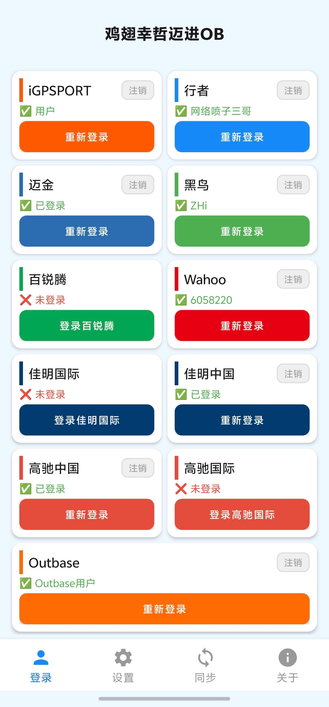
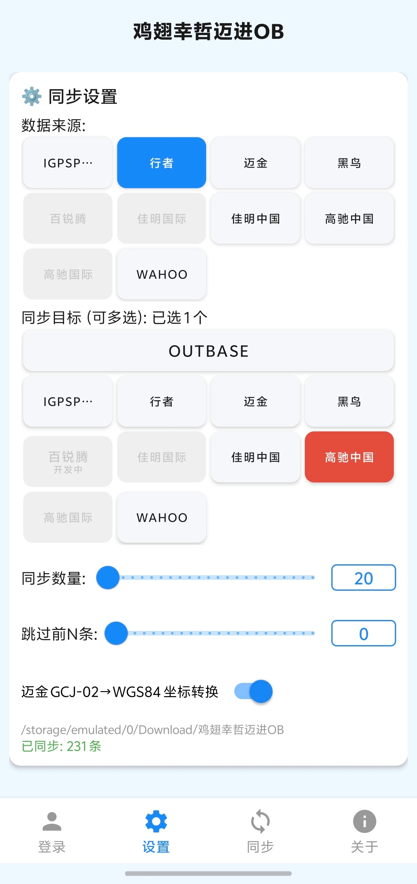
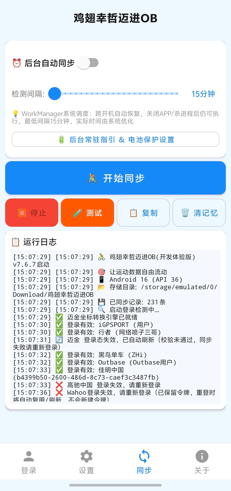
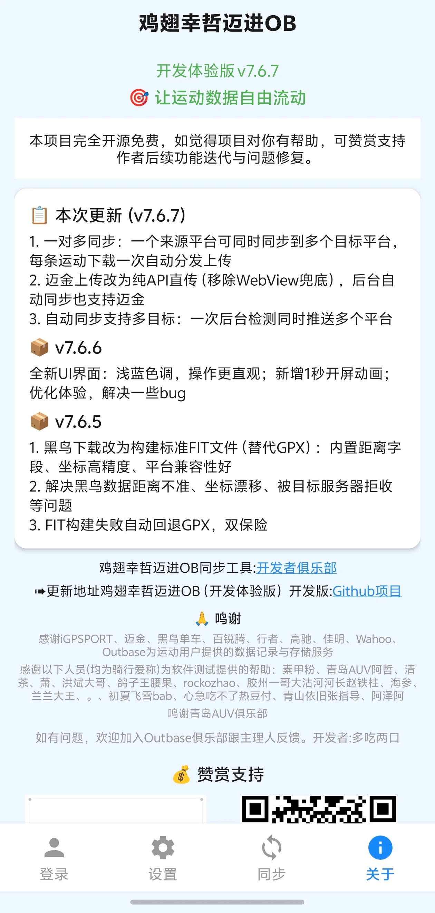

# 🚴 鸡翅幸哲迈进OB(开发体验版)

<p align="center"></p>

**让运动数据自由流动 — 十一平台运动数据互传工具**

[](https://developer.android.com)
[](https://kotlinlang.org)
[](LICENSE)
[]()
[]()

一款 Android 运动数据迁移工具，支持在 **iGPSPORT / 行者 / 迈金 / 黑鸟单车 / 百锐腾 / Outbase / 佳明国际 / 佳明中国 / 高驰中国 / 高驰国际 / Wahoo** 十一平台之间同步运动记录（FIT/GPX），支持国内区与国际区互传。

> ⚠️ **开发版仅供测试体验**，部分平台功能有限制，详见下方"已知问题与限制"。

---

## 📱 应用信息

| 项目 | 内容 |
|------|------|
| 应用名称 | 鸡翅幸哲迈进OB(开发体验版) |
| 包名 | `com.jichi.ob.dev` |
| 当前版本 | v7.6.4 |
| 最低系统 | Android 8.0 (API 26) |
| 目标系统 | Android 16 (API 36) |
| 开发语言 | Kotlin |
| 稳定版下载 | [点击下载稳定版](https://github.com/Anathleticbicyclist/sync-igpsport-magene-onelap-xingzhe-data-to-outbase)（日常使用建议稳定版，更加稳定） |
| 联系我们 | [加入Outbase俱乐部](https://outbase.cn/zeusfit/zeusfit-mk/sharePage.html?_bid=1005477&type=club&clubId=MTAxMjgz&timestamp=1787569599904&sign=b4604ad9041551e64ce90ea385a0029f)（反馈问题、测试新功能、与主理人交流） |

---

## 📱 界面预览（四页面布局）

<p align="center">
  
  
  
  
</p>

| 页面 | 功能 |
|------|------|
| 登录 | 十一平台登录状态与登录入口 |
| 数据同步设置 | 数据来源/目标选择、同步数量/跳过手动输入、迈金坐标转换 |
| 同步 | 后台自动同步、开始/停止/测试/复制/清记忆、运行日志 |
| 关于 | 版本信息、更新日志、鸣谢、赞赏支持 |

---

## ⚠️ 已知问题与限制

使用前请务必了解以下已知问题：

| 问题 | 影响范围 | 说明 | 状态 |
|------|---------|------|------|
| **佳明中国速度较慢** | 佳明中国上传/下载 | 佳明中国connectapi服务器处理速度较慢，上传约需30-60秒（服务器端解析FIT、校验重复、入库），获取活动列表约需10-30秒。功能正常，仅速度较慢 | 已知问题，服务器端限制 |
| **百锐腾下载不支持** | 百锐腾作为数据源 | 百锐腾官方未开放FIT下载接口，无法从百锐腾下载活动记录 | 平台限制，无法解决 |
| **迈金上传API直传** | 迈金作为同步目标 | **v7.6.3 已支持**：顽鹿OTM新上传接口API直传（`/api/otm/ride_record/upload/fit`，字段`jilu0`+token鉴权），上传后约15-20秒异步入库，可在顽鹿官网"自行车→OTM→我的活动"查看；失败自动回退WebView通道 | v7.6.3已支持 |
| **迈金重启后需重新登录** | 迈金作为数据源/同步目标 | 应用重启后迈金(顽鹿OTM)登录态可能失效。已自动处理：启动时自动登录检测，失效自动用 refresh_token 刷新；仅当刷新失败时才需手动重新登录 | 自动处理 |
| **Outbase仅支持上传** | Outbase作为数据源 | Outbase为聚合上传平台，仅支持上传，不支持从Outbase下载 | 平台限制 |
| **黑鸟数据同步异常** | 黑鸟单车作为数据源 | 黑鸟导出的部分记录同步到**其他平台**时，可能因黑鸟自身记录格式与目标平台解析/适配的差异，出现乱码、上传失败，或**公里数/距离异常增加**（数据被重复解析或多算）等问题 | 建议绕行方案（见FAQ） |
| **iGPSPORT→Wahoo部分文件上传失败** | iGPSPORT上传到Wahoo | 部分iGPSPORT导出的FIT文件存在时间戳溢出（接近2^32）和字符串字段混入二进制数据的问题，导致Wahoo服务器解析失败（报错invalid ASCII control character或Mysql2::Error），这部分文件成功被解析的概率为50~80%，格式正常的文件可正常上传 | 已知问题，考虑FIT转GPX方案（可能丢失功率、心率、踏频等传感器数据） |
| **Wahoo令牌数量超限** | Wahoo登录 | Wahoo规定每个用户最多保留10枚未撤销令牌。**v7.6.0修复版起已彻底解决**：凭证自动复用/刷新，刷新后自动撤销旧令牌，不会累积超限。旧版本曾有此问题，升级到 v7.6.0 修复版即可；若当前账号已超限，按常见问题指引手动撤销一次即可恢复 | v7.6.0修复版已解决 |
| **两步验证(MFA)** | 佳明中国/国际登录 | 佳明账号若开启两步验证，需先在佳明App中关闭，当前版本不支持MFA验证码输入 | 已知限制 |
| **高驰活动列表仅200条** | 高驰作为数据源 | v7.6.3及之前版本，高驰活动列表只拉取第一页（每页最多200条），超过200条的活动无法获取。**v7.6.4 已修复**：改为循环翻页，支持拉取全部活动记录。升级到 v7.6.4 或更新版本即可 | v7.6.4已修复 |

---

## 📖 使用说明

### 快速开始

1. **安装APK**：下载最新版本APK，允许安装未知来源应用
2. **授予权限**：首次打开授予存储权限（用于保存下载的FIT文件）
3. **登录平台**：在登录页点击对应平台卡片，完成登录
4. **选择同步方向**：在同步设置页选择"数据来源"和"同步目标"
5. **设置参数**：调整同步数量、跳过数量（可选）
6. **开始同步**：点击"开始同步"按钮，查看运行日志

### 登录各平台

| 平台 | 登录方式 |
|------|---------|
| iGPSPORT | 账号登录 |
| 行者 | 账号登录 |
| 迈金 | 账号登录 |
| 黑鸟单车 | 账号登录 |
| 百锐腾 | 账号登录 |
| Outbase | 手机号验证码登录 |
| 佳明国际 | 账号登录 |
| 佳明中国 | 账号登录 |
| 高驰中国 | 账号登录 |
| 高驰国际 | 账号登录 |
| Wahoo | 账号登录 |

> ⚠️ **佳明账号**：若开启两步验证(MFA)，需先在佳明App中关闭，当前版本不支持MFA验证码输入。

### 同步操作

1. **数据来源**：选择从哪个平台下载活动记录（左侧四列网格）
2. **同步目标**：选择上传到哪个平台（右侧四列网格，Outbase独占一行）
3. **同步数量**：滑动条设置每次同步的活动数量（1~50条）
4. **跳过数量**：滑动条设置跳过最近的N条活动（用于增量同步）
5. **开始同步**：点击后自动执行"下载→保存→上传"流程
6. **停止同步**：同步过程中可随时点击停止

**同步流程**：
```
获取活动列表 → 下载FIT文件 → 保存到本地 → 上传到目标平台 → 记录同步记忆
```

### 高级功能

| 功能 | 说明 |
|------|------|
| **后台自动同步** | WorkManager系统调度，间隔15分钟~1小时可调，跨开机自动恢复，同步中显示前台通知，完成后显示可清除摘要通知 |
| **测试下载** | 单条下载验证，用于测试平台登录和下载功能是否正常 |
| **同步记忆** | 已同步的活动自动跳过，避免重复上传，上限10000条 |
| **清除同步记忆** | 清除所有同步记录，下次同步将重新全量上传 |
| **运行日志** | 实时显示同步过程中的详细日志，便于排查问题 |
| **文件本地存储** | 下载的FIT文件保存到 `Download/鸡翅幸哲迈进OB/` 目录 |

### 常见问题

**Q: 同步失败怎么办？**
A: 查看运行日志中的错误信息，常见原因：
- 登录态过期 → 重新登录对应平台
- 网络问题 → 检查网络连接
- 平台服务器限流 → 等待一段时间后重试
- 文件格式不支持 → 确认目标平台支持FIT格式

**Q: 为什么有些活动被跳过了？**
A: 已同步的活动会被自动跳过（同步记忆）。如需重新上传，点击"清除同步记忆"。

**Q: 下载的文件在哪里？**
A: 保存在手机存储的 `Download/鸡翅幸哲迈进OB/` 目录，可用文件管理器查看。

**Q: 佳明中国为什么这么慢？**
A: 佳明中国connectapi服务器处理速度较慢（上传约30-60秒），这是服务器端限制，功能正常。

**Q: 行者上传到iGPSPORT时间不对？**
A: 已解决。v7.5.2起行者→iGPSPORT改用GPX优先下载，时间戳正确，无8小时时差。

**Q: 上传到黑鸟失败（提示 FIT_FILE_ERROR / HTTP 500 / 文件无法解析）？**
A: 黑鸟要求标准 FIT 文件，历史版本 GPX 转 FIT 不完整导致黑鸟无法解析（v6.2.x 存在 FIT_FILE_ERROR；v6.4.1~v6.4.3 修复"黑鸟上传 HTTP 500"和"时间偏移8小时"，改用官方 gpx2fit 转换）。**v6.4.x 起已解决**，当前版本正常上传。若仍失败，多为源文件本身异常（如 iGPSPORT 导出的异常 FIT），可换数据源测试。

**Q: 黑鸟上传到其他平台失败，或公里数异常增加怎么办？**
A: 黑鸟单车作为**数据源**（黑鸟 → 其他平台）时，部分记录可能因黑鸟自身的记录格式与目标平台解析、适配方式的差异，出现**上传失败、乱码、距离/公里数异常增加**（数据被重复解析或多算）、字段错乱等问题。这是黑鸟数据的兼容性问题，**不是本软件故障**，且不同批次记录表现不一（有的正常、有的异常）。

推荐解决方案（**清洗法**）：把黑鸟数据**先同步到行者，再从行者转发到目标平台**。行者平台会对传入的 FIT/GPX 做一次完整的解析与重新标准化，相当于对黑鸟原始数据做了一遍**筛选和清洗**，转换后的数据能够更好地被其他平台识别，显著降低上传失败与公里数异常的概率。

操作步骤：
1. 来源选「黑鸟单车」→ 目标选「行者」，执行一次同步（黑鸟 → 行者）
2. 再来源选「行者」→ 目标选其他目标平台，执行一次同步（行者 → 目标）

> 💡 行者对数据的清洗/标准化作用，与迈金 GCJ-02 坐标转换类似，都是通过中间平台规范化后再分发，兼容性更好。若清洗后仍有单条记录异常，可换数据源或手动导出该条记录重新上传。

**Q: iGPSPORT 登录成功，但获取列表/上传报 403（Token has expired）？**
A: 这是"旧通行证"问题——登录页 WebView 残留了**过期的 localStorage/cookie**，重新登录时 app 提取到旧 token，看似登录成功实则已失效。
- 影响版本：**v7.6.0 修复版之前**的所有版本都可能遇到（登录态只解析 JWT 不校验有效期）
- **解决版本：v7.6.0 修复版起**，登录页提取 token 后会真实校验，无效自动清缓存强制重新登录
- 升级到 **v7.6.0 修复版或更新版本**即可；若已升级仍遇 403，到登录页重新登录一次（会自动清缓存）

**Q: 佳明中国批量上传失败，提示 "Required SETTINGS preface not received"？**
A: 这是 OkHttp HTTP/2 连接握手不稳定的连接层错误，与佳明服务器无关：
- 影响版本：v7.5.1 ~ v7.5.9（佳明中国可用但约24%上传失败率，下载偶发同因失败）
- **解决版本：v7.6.0 起**强制 HTTP/1.1 + 连接错误自动重试（最多3次），上传/下载均修复
- 升级到 **v7.6.0 或更新版本**即可

**Q: 开启自动同步后闪退？**
A: Android 14+ 前台服务类型问题，v7.5.5~v7.5.7 曾出现（InvalidForegroundServiceTypeException）。**v7.5.8 起已修复**（显式声明 DATA_SYNC 前台服务类型 + 全局崩溃捕获）。当前版本正常。

**Q: 日志显示"上传失败"但实际是重复文件（行者 9006 / Wahoo 422）？**
A: 重复文件被误计为"失败"的统计问题：
- 影响版本：v7.5.9 之前
- **解决版本：v7.5.9 起**统一归为"跳过"并自动记入同步记忆，下次检测直接跳过，统计更准确。当前版本正常。

**Q: 迈金同步提示"获取列表失败"或"同步失败"怎么办？**
A: 这是迈金(顽鹿OTM)登录态失效的已知问题。**v7.5.9 起已自动处理**：应用启动时会自动检测迈金登录态，若失效会尝试用 refresh_token 自动刷新（日志显示"🔄 迈金 登录态失效，已自动刷新"），无需手动操作。仅当 refresh_token 也失效（日志显示"❌ 迈金 登录失效，请重新登录"）时，需要手动重登：
1. 前往登录页重新登录迈金账号
2. 若首次登录后仍失败，可再点一次重新登录，直到活动列表加载成功
3. 登录态恢复后即可正常同步

> ⚠️ **提示**：若启动日志显示"❌ 迈金 登录失效，请重新登录"，说明自动刷新失败，需到登录页重新登录迈金；登录成功后下次启动即会自动检测并保持登录态。

**Q: 提示"Wahoo令牌数量超限"或登录报错"Too many unrevoked access tokens"怎么办？**
A: Wahoo规定每个用户在本应用下最多保留 **10枚未撤销令牌**。部分版本存在bug会导致频繁新建令牌、旧令牌未撤销不断累积，最终触发超限：

| 版本 | 是否有此问题 |
|------|-------------|
| v7.5.4 ~ v7.5.8 | ✅ 无问题（有令牌复用机制，登录前自动复用/刷新已有令牌） |
| **v7.5.9** | ❌ **有问题**（启动登录检测会清除Wahoo本地凭证，重登每次新建令牌） |
| **v7.6.0（首版）** | ❌ **有问题**（同上） |
| **v7.6.0（修复版）及以后** | ✅ 无问题（启动检测保留凭证 + 重登自动复用/刷新 + 刷新后自动撤销旧令牌） |

**请升级到 v7.6.0（修复版）或最新版本**，正常使用不会再触发令牌超限。

如果当前账号已经超限（日志提示已达10枚上限），需要先释放名额：
1. 打开手机上的 **Wahoo官方App**
2. 进入 **设置(Settings) → 已授权应用(Authorized Apps)**（旧版路径：Today → Profile → Authorized Apps）
3. 找到"鸡翅幸哲迈进OB"，点击 **撤销授权(Deauthorize)**
4. 回到本应用重新登录即可

> 💡 v7.6.0（修复版）起：重新登录时会**自动复用已有令牌**或**自动刷新**（不会新建多余令牌）；令牌刷新后会自动撤销旧令牌。若长期不用（超过60天），Wahoo会自动清理未撤销令牌。仅当所有旧令牌都失效时，才需要按上面步骤手动撤销释放名额。

**Q: 高驰活动列表只能拉取200条，超过200条无法获取怎么办？**
A: 这是高驰分页逻辑的 bug——活动列表接口每页最多返回200条，旧版本只请求第一页，导致超过200条的活动无法获取。

| 版本 | 是否有此问题 |
|------|-------------|
| v7.6.3 及之前 | ❌ 有问题（只拉第一页，最多200条） |
| **v7.6.4 及以后** | ✅ 已修复（循环翻页，支持拉取全部活动记录） |

**请升级到 v7.6.4 或最新版本**，高驰作为数据源时可拉取全部活动记录（同步数量设多少就拉多少，最多1000条）。

---

## ✨ 功能特性

### 十一平台数据互传

| 平台 | 下载(源) | 上传(目标) | 说明 |
|------|:---:|:---:|------|
| **iGPSPORT** | ✅ | ✅ | 迹驰码表数据，OSS直传上传 |
| **行者** | ✅ | ✅ | 行者APP数据，官方开放API |
| **迈金** | ✅ | ✅ | 顽鹿OTM API直传上传（v7.6.3），支持GCJ-02→WGS84坐标转换 |
| **黑鸟单车** | ✅ | ✅ | 仅接受FIT，GPX自动转换 |
| **百锐腾** | ⚠️ | 🚧 开发中 | 官方未开放FIT下载接口 |
| **Outbase** | ❌ | ✅ | 仅目标平台，聚合上传 |
| **佳明国际** | ✅ | ✅ | Garmin Connect国际区，mobile SSO+DI Token |
| **佳明中国** | ✅ | ✅ | Garmin Connect中国区，mobile SSO+DI Token（参考garth库），connectapi不经过Cloudflare（⚠️速度较慢） |
| **高驰中国** | ✅ | ✅ | COROS中国区，OSS+fit/import上传 |
| **高驰国际** | ✅ | ✅ | COROS国际/欧洲区，AWS S3上传 |
| **Wahoo** | ✅ | ✅ | Wahoo官方API，直接登录+base64编码上传+轮询状态 |

**支持的同步组合**：
- 任意平台 → Outbase 上传
- iGPSPORT / 行者 / 迈金 / 黑鸟 / 佳明(CN/COM) / 高驰(CN/INT) / Wahoo 之间任意互传
- 国内区↔国际区互传：佳明国际↔佳明中国、高驰中国↔高驰国际

### 迈金坐标转换（亮点功能）

迈金设备导出的FIT文件使用 **GCJ-02（火星坐标）**，直接上传到支持 WGS84 坐标的平台会发生**坐标偏移**（青岛地区实测约450米），导致无法匹配赛段/路段、排行榜定位不准。

本软件内置 **GCJ-02 → WGS84 坐标转换引擎**（移植自开源算法，隐藏WebView执行JavaScript解析FIT二进制），迈金文件在上传前**自动完成坐标纠偏**：

- 上传到其他平台后**坐标无偏移**，可正常匹配赛段、路段、排行榜
- 引擎启动时自动就绪（日志"✅ 迈金坐标转换引擎已就绪"），全程无需手动操作
- 仅针对迈金（GCJ-02）文件启用，其他平台文件不受影响

### 核心功能

- **数据来源记忆**：自动记住上次选择，重启恢复
- **文件本地存储**：下载文件保存到 `Download/鸡翅幸哲迈进OB/`
- **迈金坐标转换**：GCJ-02→WGS84自动纠偏（青岛实测偏移约450米），保证上传其他平台后坐标无偏移、可匹配赛段
- **同步记忆**：已同步记录自动跳过，上限10000条
- **后台自动同步**：WorkManager系统调度，间隔15分钟~1小时，跨开机/杀进程后仍可执行，更省电
- **测试下载**：单条下载验证功能
- **登录状态显示**：已登录状态一目了然

---

## 🏗️ 关键技术

1. **佳明国际/中国 mobile SSO**：参考garth库，通过mobile SSO登录获取serviceTicket → OAuth1 preauthorized → OAuth2 exchange → DI Bearer token，访问connectapi.garmin.com/cn绕过Cloudflare
2. **Wahoo OAuth2直接登录**：OkHttp模拟浏览器完成SAML登录+OAuth2授权全流程，自动识别中文"授权"按钮，获取access_token（含workouts_write上传权限）
3. **Wahoo上传下载**：官方API，base64编码上传+轮询处理状态，支持FIT文件
4. **FIT坐标转换（迈金亮点）**：隐藏WebView执行JavaScript解析FIT二进制，迈金GCJ-02→WGS84自动纠偏，上传其他平台坐标无偏移、可匹配赛段
5. **协程异步**：全部网络请求Kotlin Coroutines，主线程安全
6. **后台自动同步（WorkManager方案）**：v7.5.5起改用WorkManager系统调度替代原前台Service方案。新方案跨开机自动恢复、杀进程/关APP后仍可执行、Doze省电模式下不受影响、仅在网络已连接时执行，更加省电可靠。代价是最低间隔15分钟（PeriodicWorkRequest系统限制），实际执行时间由系统优化不保证精确。状态栏通知：同步进行中显示前台通知（源→目标平台、当前动作、间隔），同步完成后显示可清除摘要通知（新上传X条/无最新、最近活动日期、下次检测时间）。**版本说明**：v7.5.5首次启用但不稳定（Android16+ InvalidForegroundServiceTypeException闪退），v7.5.6~v7.5.7持续修复仍未解决根因，**v7.5.8修复根因（ForegroundInfo三参数构造函数显式指定DATA_SYNC类型）后稳定，建议使用v7.5.8及以上版本**。v7.5.4及以前为前台Service方案（间隔精确可短至30秒，但耗电、国产ROM易被杀、不跨开机）。

---

## 🛠️ 构建说明

### 环境要求
- JDK 17
- Android SDK Platform 36 + Build Tools 35.0.0
- Gradle 8.13

### 构建步骤
```bash
git clone https://github.com/Anathleticbicyclist/sports-data-sync-multiplatform.git
cd sports-data-sync-multiplatform
echo "sdk.dir=/path/to/android-sdk" > local.properties
./gradlew assembleRelease
```

---

## 🙏 鸣谢

### 🏢 平台鸣谢

感谢iGPSPORT、行者、迈金、黑鸟单车、百锐腾、Outbase、佳明、高驰、Wahoo为运动用户提供的数据记录与存储服务。

- iGPSPORT迹驰 — [Innovation for Great Performance @ SPORTS](https://www.igpsport.com)
- 行者 — [虽千万里 吾往矣](https://www.imxingzhe.com)
- 迈金Magene — [让运动更科学](https://www.magene.cn)
- 黑鸟单车 — [黑鸟单车 骑乐无穷](https://www.blackbirdsport.com)
- 百锐腾Bryton — [Engineered for Great Performance](https://www.brytonsport.com)
- Outbase — [用运动连接世界](https://outbase.cn)
- 佳明Garmin — [Engineered on the inside for life on the outside](https://www.garmin.com.cn)
- 高驰COROS — [保持专注 乐于创新 满怀热情](https://www.coros.com)
- Wahoo — [Create a full ecosystem of sensors and devices](https://www.wahoofitness.com)

> 各平台运动数据的相关权益归该数据产生用户及相应平台依法各自享有。本工具仅用于用户本人数据在其已授权账号之间的迁移与备份，不得用于商业用途、批量数据爬取或任何侵犯他人合法权益的行为。用户应对其使用本工具处理数据的合法性负责，因数据迁移产生的纠纷由用户自行承担。

### 👥 测试人员鸣谢

感谢以下人员（均为骑行爱称）为软件测试提供的帮助：

素甲粉、青岛AUV阿哲、清茶、萧、洪斌大哥、鸽子王腰果、rockozhao、胶州一哥大沽河河长赵铁柱、海参、兰兰大王、。、初夏飞雪bab、心急吃不了热豆付、青山依旧张指导、阿泽阿

鸣谢青岛AUV俱乐部

### 📦 开源项目鸣谢

本项目在开发过程中参考并借鉴了以下开源项目，在此向这些项目的作者表示衷心感谢：

1. **[garth](https://github.com/matin/garth)** — 佳明中国/国际mobile SSO登录+OAuth2认证核心算法参考，本项目佳明中国方案的重要理论基础
2. **[dwmer0308-a11y/magene-fit-strava-fix](https://github.com/dwmer0308-a11y/magene-fit-strava-fix)** — 迈金FIT文件GCJ-02→WGS84坐标转换核心算法，已移植到APP中（`assets/magene_fix.js`）
3. **[dofek/wahoolib](https://github.com/dofek/wahoolib)** — Wahoo OAuth2授权码捕获方案参考
4. **其他依赖库**：OkHttp、Kotlin Coroutines、Material Components for Android、AndroidX

### 🏠 开发者俱乐部

**鸡翅幸哲迈进OB同步工具开发者俱乐部**

欢迎加入开发者俱乐部，与主理人和其他开发者一起交流、测试、反馈：

🔗 [点击加入俱乐部](https://outbase.cn/zeusfit/zeusfit-mk/sharePage.html?_bid=1005477&type=club&clubId=MTAxMjgz&timestamp=1787569599904&sign=b4604ad9041551e64ce90ea385a0029f)

> 如有问题，欢迎加入俱乐部跟主理人反馈。开发中功能招募测试人员，欢迎联系主理人~

---

## 📋 更新日志

### v7.6.4 (2026-09-05)
**已解决**：
- **高驰活动列表分页修复**：此前版本只拉取第一页（最多200条），超过200条的活动无法获取。改为循环翻页，支持拉取全部活动记录（同步数量设多少拉多少，最多1000条）
- 高驰分页拉取时遇到错误返回已获取部分，不再整体失败
**未解决**：
- 佳明中国上传下载速度较慢（服务器端限制）
- iGPSPORT→Wahoo部分FIT文件上传失败（文件格式异常）


### v7.6.3 (2026-09-04)
**已解决**：
- **迈金上传功能完成**：顽鹿OTM新接口API直传（`/api/otm/ride_record/upload/fit`，multipart字段`jilu0`+token鉴权），替代原WebView页面自动化上传，上传更快更稳、可正确入库
- 迈金同步目标按钮由"开发中"转为正式可用
- 迈金上传失败自动回退WebView通道兜底，双保险
**未解决**：
- 佳明中国上传下载速度较慢（服务器端限制）
- iGPSPORT→Wahoo部分FIT文件上传失败（文件格式异常）
### v7.6.2 (2026-09-04)
**已解决**：
- 全新四页面布局：登录 / 数据同步设置 / 同步 / 关于，底部导航快速切换，操作更直观
- 登录页恢复原版布局，Outbase独占一行，Slogan移至关于页
- 同步数量/跳过数量支持手动输入
- 修复Outbase登录过期凭证误判问题
- 关于页新增版本号对应、本次及最近两版本更新日志、鸣谢、赞赏支持
- 历史安装包统一归档至"历史apk"目录，仓库根目录仅保留当前版本
**未解决**：
- 佳明中国上传下载速度较慢（服务器端限制）
- iGPSPORT→Wahoo部分FIT文件上传失败（文件格式异常）
### v7.6.1 (2026-09-03)
**已解决**：
- 修复Outbase登录凭据检测误判：user/info校验接口header不完整，导致有效sessionId被误判失效、每次启动都需重新登录。现用完整header校验+回退warmUp可靠校验+网络异常保守判定，有效sessionId直接确认已登录，不再误清凭证
- 启动登录检测增强：自动刷新后校验新token有效性并输出明确日志（如"🔄 迈金 登录态失效，已自动刷新 ✅ 登录有效 (用户名)"），成功/失败一目了然
**未解决**：
- 佳明中国上传下载速度较慢（服务器端限制）
- iGPSPORT→Wahoo部分FIT文件上传失败（文件格式异常）
### v7.6.0 (2026-09-03)
**已解决**：
- 佳明中国上传/下载稳定：强制HTTP/1.1连接 + 连接错误自动重试，根治"Required SETTINGS preface not received"（此前约24%上传失败率，下载同因失败）
- Wahoo令牌机制完善：凭证自动复用/刷新，刷新后自动撤销旧令牌，杜绝"10枚未撤销令牌超限"；登录态真实校验，能上传下载即判定有效，不再误报失效
- iGPSPORT登录检测与重新登录优化：真实校验token有效性，重新登录自动清除旧缓存获取新令牌，不再"登录成功但仍403"
- 重复活动统一归为"跳过"（佳明/行者/Wahoo），统计更准确
**未解决**：
- 佳明中国上传下载速度较慢（服务器端限制）
- iGPSPORT→Wahoo部分FIT文件上传失败（文件格式异常）
### v7.5.9 (2026-09-03)
**已解决**：
- Wahoo重复文件(HTTP 422 Duplicate workout file detected)改为归为"跳过"而非"失败"，并自动记入同步记忆，下次检测直接跳过
- 行者重复文件(HTTP 400 code:9006"文件已上传")同样归为"跳过"，统计更准确
- 新增启动登录检测：启动时校验已登录平台的登录态，失效平台自动尝试刷新（迈金/Wahoo支持），刷新失败清除凭证并提示重新登录，登录状态变未登录
**未解决**：
- 佳明中国上传下载速度较慢（服务器端限制）
- iGPSPORT→Wahoo部分FIT文件上传失败（需FIT转GPX或修复异常字段）
### v7.5.8 (2026-09-03)
**已解决**：
- 修复自动同步闪退根因：WorkManager ForegroundInfo必须用三参数构造函数显式指定foregroundServiceType=DATA_SYNC，否则Android16+报InvalidForegroundServiceTypeException(type none)闪退
**未解决**：
- 佳明中国上传下载速度较慢（服务器端限制）
- iGPSPORT→Wahoo部分FIT文件上传失败（需FIT转GPX或修复异常字段）
### v7.5.7 (2026-09-03)
**已解决**：
- 修复开启自动同步后闪退（setForeground()包try-catch降级，startAutoSync包try-catch，全局崩溃捕获写入文件）
- 新增全局崩溃捕获：闪退时堆栈写入本地文件，下次启动显示在运行日志中，便于定位问题
- setForeground()失败时自动降级为普通通知，保证不闪退
**未解决**：
- 佳明中国上传下载速度较慢（服务器端限制）
- iGPSPORT→Wahoo部分FIT文件上传失败（需FIT转GPX或修复异常字段）
### v7.5.6 (2026-09-03)
**已解决**：
- 修复开启自动同步后闪退（Android14+ WorkManager前台服务需声明foregroundServiceType）
- 修复关闭自动同步后状态栏通知不消失（Worker onStopped时主动取消前台+摘要通知）
- 增强自动同步状态栏信息：显示源平台→目标平台、同步间隔、最近检测的活动日期与状态（新上传X条/无最新已上传）、下次检测时间
- 同步完成后发送可清除的摘要通知，记录最近同步结果到本地存储
**未解决**：
- 佳明中国上传下载速度较慢（服务器端限制）
- iGPSPORT→Wahoo部分FIT文件上传失败（需FIT转GPX或修复异常字段）
### v7.5.5 (2026-09-03)
**已解决**：
- 后台自动同步改用WorkManager系统调度（替代原前台Service方案），跨开机自动恢复，杀进程/关APP后仍可执行，Doze省电模式下不受影响
- 自动同步间隔下限调整为15分钟（WorkManager PeriodicWorkRequest限制），滑块步长改为1分钟
- 自动同步仅在网络已连接时执行（Constraints约束），避免无网空跑
- 自动同步设置页底部添加机制说明
**未解决**：
- 佳明中国上传下载速度较慢（服务器端限制）
- iGPSPORT→Wahoo部分FIT文件上传失败（需FIT转GPX或修复异常字段）
### v7.5.4 (2026-09-03)
**已解决**：
- Wahoo登录前复用已有token（有效则直接用、过期则refresh），避免每次登录新建token导致数量超限
- Wahoo token数量超限时自动尝试deauthorize清理旧token，并弹出明确引导（指引用户在Wahoo App撤销授权后重新登录）
- Wahoo登录失败时显示真实错误原因（不再笼统报"请检查邮箱密码"）
**未解决**：
- 佳明中国上传下载速度较慢（服务器端限制）
- iGPSPORT→Wahoo部分FIT文件上传失败（需FIT转GPX或修复异常字段）
### v7.5.3 (2026-09-03)
**已解决**：
- Wahoo OAuth2 PKCE实现：生成code_verifier + code_challenge(SHA256)，授权URL带code_challenge，换token带code_verifier（修复"拿到授权码但换token失败"的根本原因）
- Wahoo SAML表单action相对路径bug：用resolveUrl补全域名（修复Expected URL scheme崩溃）
- Wahoo token换取失败时打印响应体（便于定位真实错误码）
- Wahoo上传前自动刷新token（ensureValidToken，类似佳明的处理）
- Wahoo上传401时自动刷新token并重试一次

**未解决**：
- 佳明中国上传下载速度较慢（服务器端限制）
- iGPSPORT→Wahoo部分FIT文件上传失败（需FIT转GPX或修复异常字段）


### v7.5.2 (2026-09-03)
**已解决**：
- 行者→iGPSPORT 8小时时差问题（改用GPX优先下载，时间戳正确）
- iGPSPORT→Wahoo上传失败原因分析：iGPSPORT FIT文件存在时间戳溢出和字符串字段异常（iGPSPORT不支持GPX直接下载，后续研究FIT转GPX方案）

**未解决**：
- 佳明中国上传下载速度较慢（服务器端限制）
- iGPSPORT→Wahoo部分FIT文件上传失败（需FIT转GPX或修复异常字段）

### v7.5.1 (2026-09-03)
**已解决**：
- 佳明中国登录、上传、下载全部修复（改用garth库方案：mobile SSO+OAuth2 Bearer token+connectapi）

**未解决**：
- 佳明中国上传下载速度较慢（服务器端限制）

### v7.5.0 ~ v7.4.6 (2026-09-03) — 佳明中国修复尝试（均未成功）
**已解决**：
- v7.4.9: 修复cookie被清除问题（只清佳明域名，保留其他平台登录态）

**未解决**：
- 佳明中国登录成功但获取活动列表0条、上传403或卡住
- 尝试方案：favicon.ico页面、不加载页面注入cookie、gc-api+保存所有cookie、WebView直接加载URL，均未成功

### v7.4.5 (2026-09-03)
**已解决**：
- Wahoo登录、上传、下载全部修复（恢复OkHttp模拟浏览器直接登录方案）
- 佳明中国上传cookie domain修复（注入到主域名.garmin.cn）

**未解决**：
- 佳明中国上传仍返回403

### v7.4.4 ~ v7.4.0 (2026-09-02~03) — Wahoo和佳明中国修复尝试
**已解决**：
- v7.4.4: Wahoo上传功能开放（workouts_write权限）
- v7.4.4: Wahoo登录回调捕获修复（shouldOverrideUrlLoading拦截回调URL）
- v7.4.3: Wahoo redirect_uri改回HTTPS（Wahoo要求HTTPS）

**未解决**：
- Wahoo登录仍不稳定（回调捕获失败）
- 佳明中国上传返回403

### v7.3.1 ~ v7.2.0 (2026-09-02) — Wahoo登录重构
**已解决**：
- v7.3.1: 修复Wahoo登录成功但首页显示未登录的问题
- v7.3.0: 找到Wahoo登录真正根因：授权按钮是中文"授权"而非英文"Authorize"
- v7.2.2: 修复Step 1重定向处理的严重bug
- v7.2.1: 重写Wahoo登录，使用OkHttp CookieJar自动管理Cookie
- v7.2.0: 彻底重构Wahoo登录：不使用WebView，直接用OkHttp模拟OAuth2完整流程

### v7.1.9 ~ v7.1.4 (2026-09-02) — Wahoo授权码捕获修复
**已解决**：
- v7.1.9: 增强SSL错误授权码捕获
- v7.1.8: 修复Wahoo授权码捕获：在SSL证书错误时提取授权码（最关键修复）
- v7.1.7: 添加URL历史追踪，redirect_uri改HTTP
- v7.1.6: 本地测试验证后彻底修复Wahoo授权码捕获
- v7.1.5: 彻底修复Wahoo授权码捕获（参考开源项目dofek/wahoolib）
- v7.1.4: 修复Wahoo授权码捕获失败

### v7.1.3 ~ v7.1.0 (2026-09-02) — Wahoo生产凭证 + 行者→iGPSPORT时间修复
**已解决**：
- v7.1.3: Wahoo生产应用已批准，内置生产凭证
- v7.1.3: 回滚行者→iGPSPORT时间修正（修改后导致iGPSPORT解析失败）
- v7.1.1: 修复行者→iGPSPORT activity消息时间戳未修改导致解析失败
- v7.1.0: 行者→iGPSPORT时间修复稳定版

**未解决**：
- 行者→iGPSPORT 8小时时差（时间戳修改导致解析失败，回滚后仍存在）

### v7.0.91 ~ v7.0.4 (2026-09-02) — 早期修复
**已解决**：
- v7.0.91: 修复行者→iGPSPORT经度被误改导致文件损坏
- v7.0.9: 修复行者→iGPSPORT时间字段不一致导致解析失败
- v7.0.8: 修复行者→iGPSPORT FIT文件结构损坏
- v7.0.7: 修复佳明中国WebView通道域名错误
- v7.0.6: 佳明中国用WebView绕过Cloudflare + 行者FIT时间修复 + Wahoo用户自配置
- v7.0.5: 修复行者→iGPSPORT FIT文件结构损坏
- v7.0.4: 行者→iGPSPORT FIT时间戳修正

### v7.0.x 早期版本
- 佳明国际mobile SSO+DI token绕过Cloudflare
- 十一平台基础互传功能

### v6.7.x (2026-08~09) — 佳明国际mobile SSO+WebView共享
**已解决**：
- v6.7.8: 佳明国际改用mobile SSO+DI OAuth Bearer tokens，connectapi不经过Cloudflare
- v6.7.9: 数据来源/同步目标四列网格布局，Outbase独占一行
- v6.7.4~v6.7.7: 佳明国际WebView方案修复（cookie注入、就绪等待、重定向循环、静态WebView共享）

### v6.5.x (2026-08) — 新增佳明/高驰/Wahoo，九平台互传
**已解决**：
- v6.5.0: 新增佳明(CN/COM)/高驰(CN/INT)/Wahoo同步，支持国内国际互传，UI改两列布局
- v6.5.1: Wahoo免注册改造（内置凭证）+ 佳明登录修复
- v6.5.2~v6.5.9: 佳明完整OAuth2认证重写（ticket→OAuth1→OAuth2 Bearer token）+ 高驰上传修复 + 佳明401根因修复（JWT_WEB+session双cookie）

### v6.4.x (2026-08) — 黑鸟全链路+时间适配矩阵
**已解决**：
- v6.4.0: 大版本里程碑——黑鸟全链路定稿+统一时间适配矩阵+六平台互传能力补齐
- v6.4.1~v6.4.3: 修复黑鸟上传行者HTTP 500（GPX未转FIT）+ 时间偏移8小时 + 用官方gpx2fit转FIT

### v6.3.x (2026-08) — 黑鸟上传下载+GPX转FIT+时间修正
**已解决**：
- v6.3.1: 统一上传文件名命名规则
- v6.3.4: 黑鸟上传启用（官方gpx2fit转FIT）+ 行者GPX时区修正
- v6.3.5~v6.3.6: 行者下载FIT优先（保留功率）+ 行者GPX时间全平台统一修正
- v6.3.8: 黑鸟下载重构（FIT优先+GPX完整解析心率功率时间）+ 黑鸟GCJ-02转WGS84
- v6.3.9~v6.3.10: 黑鸟时间修复（startTime秒/毫秒自动判断）+ 黑鸟GPX时间1989年问题
- v6.3.11~v6.3.13: 黑鸟GPX对所有平台统一转FIT + 回退所有GPX统一转FIT（自研FIT部分平台无法解析）
- v6.3.14~v6.3.17: 修复黑鸟长距离轨迹5000点截断 + 黑鸟推倒重写固定9字段精确解析 + 黑鸟全链路修复

### v6.2.x (2026-07~08) — 迈金上传+百锐腾+黑鸟上传
**已解决**：
- v6.2.3: 迈金顽鹿OTM WebView上传 + iGPSPORT上传落库修复
- v6.2.4: 黑鸟上传(GPX->FIT)/下载修复 + 百锐腾登录(localStorage)/上传(WebView)/列表
- v6.2.5: 修复迈金上传卡顿（恢复WebView逻辑+HTTP优先双通道）
- v6.2.6~v6.2.7: 修复Outbase上传解析失败（GPX用官方gpx2fit转FIT）+ 黑鸟FIT_FILE_ERROR修复
- v6.2.8: 同步目标逆向流动迈金/黑鸟/百锐腾标开发中 + UI按钮区对齐重排
- v6.2.9: 底部更新链接样式优化

### v6.1.x (2026-07) — 六平台基础互传
**已解决**：
- v6.1.3: 开发体验版首发——六平台运动数据互传
- v6.1.4: 修复用户名显示/电源保护/前台服务通知/黑鸟百锐腾上传
- v6.1.5: 修复按钮布局：开始同步独占整行，停止/测试/复制等宽对齐
- v6.1.7: 修复iGPSPORT上传/黑鸟列表/黑鸟登录+图标更新
- v6.1.8~v6.1.9: 更新链接指向开发测试版仓库 + 恢复正式版更新链接 + 黑鸟上传错误码翻译
- v6.2.2: UI首页标题修正 + 黑鸟GPX标识动态化

---

---

## 📌 说明

**关于版本选择**
- ⚠️ 开发版仅供测试体验，部分平台功能有限制，详见上方"已知问题与限制"
- 日常使用建议下载[稳定版](https://github.com/Anathleticbicyclist/sync-igpsport-magene-onelap-xingzhe-data-to-outbase)，更加稳定可靠
- 应用信息表中的"稳定版下载"入口同样可获取稳定版
